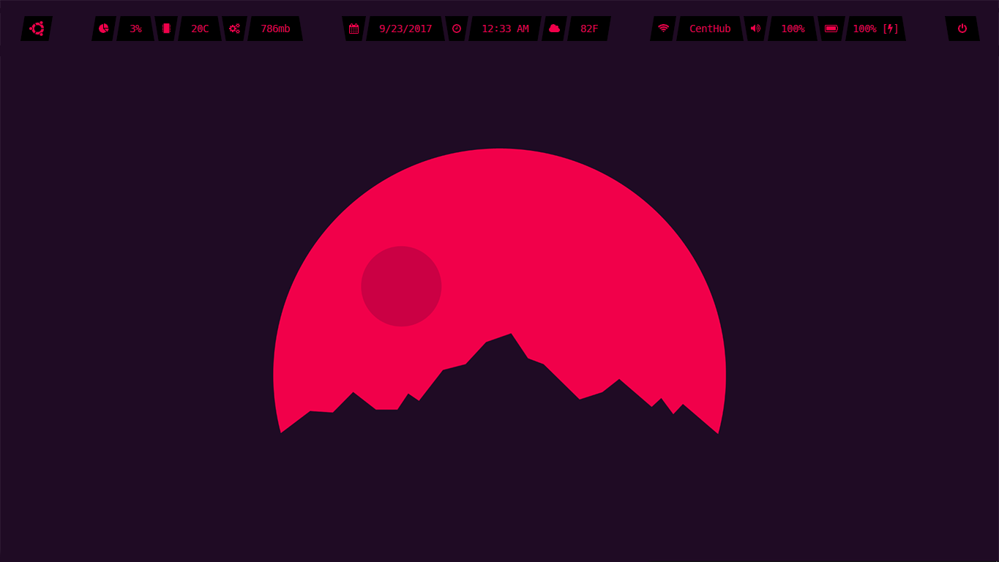
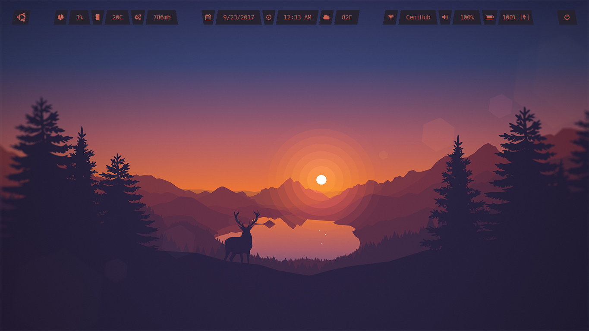
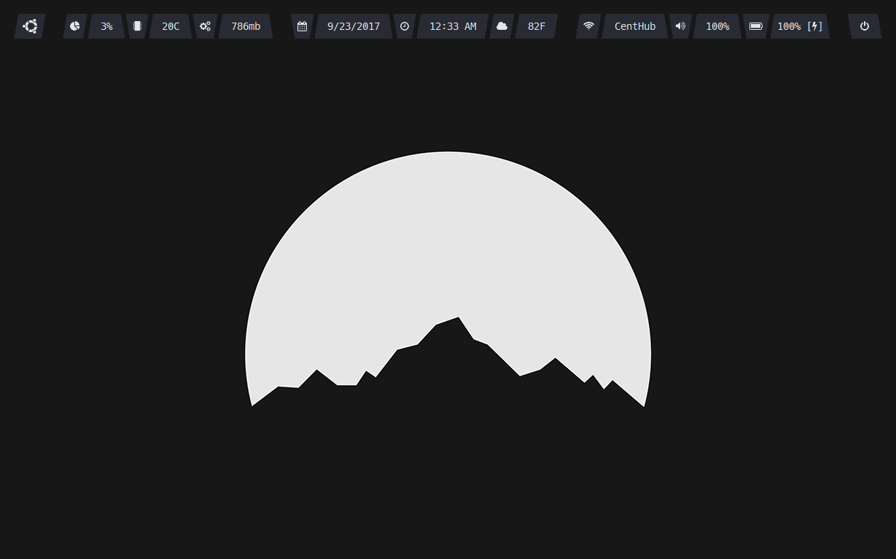

# gr8bar
A cross-platform status bar made with Qt5





## Prerequisites 

### PyQt5
```
pip3 install PyQt5
```

## Trying it out
You can try out by running:

```
python3 ./gr8bar/gr8bar.py ./test/config.py
```

## TODO
- Allow layout to be changed (QVBoxLayout vs QHBoxLayout)
